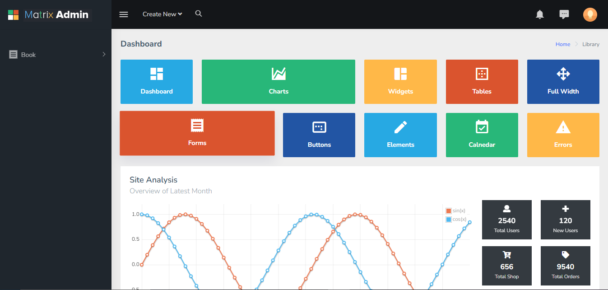
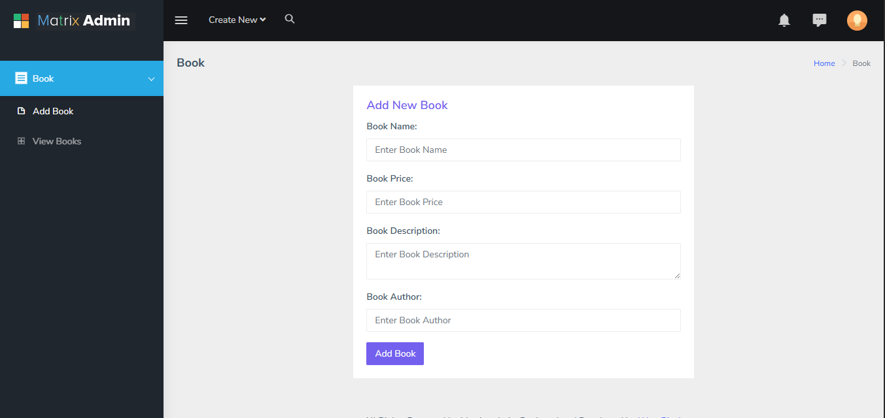
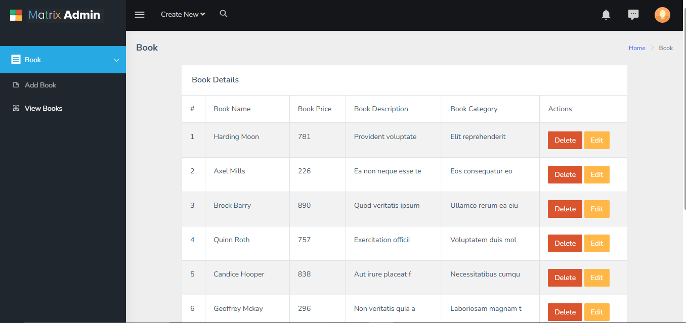

# CRUD Operation Admin Panel (Node.js)

A web-based admin panel for managing books, built with Node.js, Express, MongoDB, and EJS. This project demonstrates full CRUD (Create, Read, Update, Delete) operations with a modern, responsive UI and modular code structure.

## Output Screenshots
### Dashboard


### Add Book


### View Book


## Features
- Add, view, edit, and delete books
- Dashboard overview with statistics
- DataTables integration for sorting, searching, and pagination
- Responsive design using Bootstrap
- Notification system (Gritter, Toastr)
- Calendar integration
- User authentication (if implemented)
- Modular MVC structure for maintainability

## Technologies Used
- Node.js
- Express.js
- MongoDB & Mongoose
- EJS (Embedded JavaScript Templates)
- Bootstrap 4
- DataTables
- jQuery & plugins
- FullCalendar

## Getting Started
To clone this repository, run:
```sh
git clone https://github.com/Soaib-Shaikh/PR-Crud-Operation-Admin-Panel-Node.js.git
```
Replace `Soaib-Shaikh/PR-Crud-Operation-Admin-Panel-Node.js.git` with your actual GitHub username and repository name.

Install dependencies:
```sh
npm install
```

Start the development server:
```sh
npm run dev
```
Or for production:
```sh
npm start
```

## Folder Structure
```
├── index.js
├── package.json
├── config/
│   └── db.js
├── controllers/
│   └── book.controller.js
├── models/
│   └── book.model.js
├── output/
│   ├── addBook.png
│   ├── dashboard.png
│   └── viewBook.png
├── public/
│   ├── assets/
│   │   ├── extra-libs/
│   │   ├── images/
│   │   └── libs/
├── routers/
│   ├── book.router.js
│   └── index.js
├── views/
│   ├── index.ejs
│   ├── pages/
│   │   ├── addBook.ejs
│   │   ├── editBook.ejs
│   │   └── viewBook.ejs
│   └── partials/
│       ├── footer.ejs
│       └── header.ejs
```

---
Feel free to customize and extend the functionality as needed for your use case.
